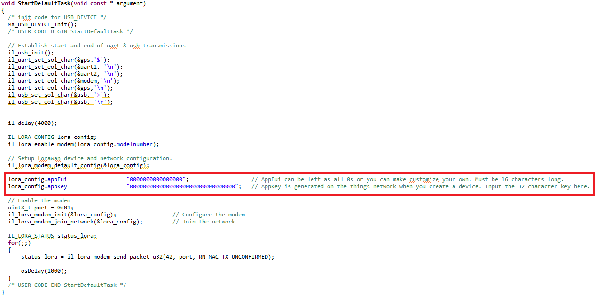

# Ironlink-Getting-Started-Lora

# Getting Started

This tutorial introduces the basics of programming your Ironlink device with a prepared program for connecting it to the internet of things. The tutorial aims to provide steps on how to program the Ironlink using the STM32CubeIDE toolchain and then to connect it to the things network using "The Things Network".

## Equipment List

The equipment needed for this tutorial and the majority of other example projects we have are:

- [Ironlink](https://www.ironlink.io/shop/)
- [Lorawan Gateway](https://www.thethingsnetwork.org/docs/gateways/thethingsindoor/)

(Recommended for debugging during development)

- [STLink](https://www.st.com/en/development-tools/st-link-v2.html)
- [JTAG Adapter](https://www.olimex.com/Products/ARM/JTAG/ARM-JTAG-20-10/)

## STM32 Example Project

The Ironlink uses an STM32 microcontroller and therefore the team has developed and provided driver libraries and project files for the STM32CubeIDE, ready for developers to use.

### STM32 Software

Firstly, we advise installing the STM32 IDE and programming tools. If you already have this installed, skip this section.

Head over and [download](https://www.st.com/en/development-tools/stm32cubeide.html) the STM32CubeIDE. This package contains the necessary tools to get started, including the code generator, programmer and editor. Select "Get Software" as seen below.


This takes you down to a list of downloads. Select the correct one for your operating system.


You will then need to accept the terms and conditions along with making an account.


Once registered, the download will begin. Move the compressed folder into an appropriate directory and unpack. Inside is an installer, execute this.


<!-- [PLACEHOLDER - INCLUDE IMAGES GOING THROUGH THE INSTALLER WIZARD] -->

Now the STM32CubeIDE is installed, you will be able to run existing projects, or make your own. For this tutorial, the project has already been created, so you will download it and open it up in STM32CubeIDE.

### Program Build

Download and open up the ["Ironlink-Getting-Started"](PLACEHOLDER.com) compressed STM32CubeIDE project.


Go into the project folder and double click on the STM32CubeIDE project file. This file holds all the configurations information for the IDE to arrange everything ready for building and programming the Ironlink.


This will open up the STM32CubeIDE program with the project in the workspace section on the left. You can open this up and explore the files of interest in "Core->Src->freertos.c". To build the project, drop down the "Project" menu at the top and select "Build Project".


Provided everything worked as expected, the project should build without errors (See [here](www.PLACEHOLDER.com) for troubleshooting if there are any issues). This means you now have a compiled program ready for the Ironlink to load and execute. In this tutorial, we will use the STM32CubeIDE to program the Ironlink using the STLink, this enables us to debug the program if necessary. If you are interested in programming the board over the USB, check out the [Programmer tutorial.](www.PLACEHOLDER.com)

### Program using STM32CubeIDE

Connect the STlink[STLink](https://www.st.com/en/development-tools/st-link-v2.html) to the Ironlink using a [JTAG Adapter](https://www.olimex.com/Products/ARM/JTAG/ARM-JTAG-20-10/) as shown below.


Connect both the STLink and Ironlink to your system via their USB connections. With this physical setup, the STM32CubeIDE should autodetect the STlink USB connection. Now, you can select either the Debug or Run options on the top of the STM32CubeIDE to program the Ironlink with the current program.


If you select the "Run" option, the STM32CubeIDE will upload the program over the STLink to the Ironlink, information about this process is printed in the console and if successful will look similar to the screenshot below.


With the program running, you will be able to see output information from the Ironlink using tools explained in the "Collecting Device Information" section. The "Debug" option will program a debug version of the code and enables breakpoints and variable watch expressions. See our [Debugging Guide](www.PLACEHOLDER.com) for more information on using the STM32CubeIDE for debugging.

### Program using STM32CubeProgrammer

The Ironlink is shipped with a USB bootloader installed. Therefore, it is possible to upload the program without the need to use an STLink, this requires using a program called the STM32CubeProgrammer. Download the tool from [here](https://www.st.com/en/development-tools/stm32cubeprog.html) by following similar steps to the STM32CubeIDE.


To launch the Ironlink's pre-installed bootloader, you must connect the GND and GPIO1 pins together while it has no power, inspect the pinout digram below and connect the pins as seen in the picture. Once these pins are connect, power the board by connecting its USB to your system.


When you have successfully installed the STM32CubeProgrammer and booted the Ironlink into the bootloader, open the STM32CubeProgrammer and you'll see a window that has a drop-down list in the top right, select "USB" from here and then refresh the port so it finds a USB device. With this all setup, select "Connect" button in green.


If successful, you will see the device memory can be read and displayed in the main window. Now connected, select the "Erasing and programming" page indicated by the arrow pointing down symbol on the left.


This brings you to the page seen below. Here, you will leave the default setup seen in the image with only "Verify programming" selected. Select the "Browse" button to indicate to the program where your binary file is.


You will have to navigate to your binary program file generated by the "Getting_Started" project. Find where your project is on your system and then follow this path:

```
Ironlink-Getting-Started -> Debug -> Ironlink-Getting-Started.bin
```


Once you have selected the file, you will need to tell the programmer where to install the application and this needs to be in a place after the bootloader where it is expected to be. Write into the "Start address:" field "0x08008000". This step is very important, if you do not do this and overwrite the bootloader, you will need to use an STLink and follow the [bootloader guide.](www.placeholder.com)


Now you can selected start programming and if successful you'll be told the programming is completed. Now, disconnect the ironlink by pressing the green "Disconnect" button in the top right, unplug your Ironlink and take the GND to GPIO1 connection off. Now you can plug your Ironlink back in and it will boot the application. Follow the terminal emulator steps in the next section to see output from the now running Ironlink application.

### Terminal Emulator

Once you have successfully programmed the Ironlink with the example program, you will need to find out your Ironlink's Lorawan hardware eui. Ensure you have followed the steps above and confirm there are no errors in your build and has successfully uploaded to the Ironlink. Now your program is running, you will need a way to read the information it records from the USB interface.

To read the recorded information logged from the Ironlink, you need to use a USB terminal emulator. At Ironlink, we are currently using [TeraTerm](https://ttssh2.osdn.jp/index.html.en) on a Microsoft operating system. Using an alternative tool such as [Putty](https://www.chiark.greenend.org.uk/~sgtatham/putty/) will work in the same way. Setup your terminal emulator to access the serial port your Ironlink is connected to and configure the settings to operate at 115200 baudrate speed.


Now when your program is running, open your terminal and you will see recorded information from your Ironlink device. Take note of the 16 characters long code printed after "sys get hweui" as you will need to set this when registering your device on the things network.


You will notice that the device attempts "mac join otaa" and the response is "denied". This is because the things network is not setup to  receive your Ironlink device yet, but you have now collected enough information to begin registering the device. You will come back to your code to enter information into the "lora_config.appEui" and "lora_config.appKey" entries, so keep the STM32CubeIDE open.



## The Things Network

In this tutorial, we advise getting your Lorawan device connected to the internet of things using [The Things Network](https://www.thethingsnetwork.org/). Head over to the home page and make an account.


The things network is migrating from its current V2 clusters to The Things Stack V3 at the end of 2021. Therefore, we will be using the V3 clusters, follow [this link](https://console.cloud.thethings.network/) to find the opening page for the V3 cluster.

---
**NOTE**

To learn more about the internet of things, check out the [Lorawan]() tutorial.

---


Select the nearest cluster (You may be prompted to login) and you'll be taken to the Things V3 console where you can add, remove and modify gateways and devices on the network. Keep this window open.


### Adding your gateway

For your device to communicate with the things network, it requires a gateway to send data to. The gateway is a Lorawan device that receives broadcast data from Lorawan devices nearby and uploads them to the cloud using a connected internet connection. All gateways receive data from any nearby Lorawan device, therefore you could rely on a nearby gateway installed by another party. However, often you will need or want to setup your own.

To begin with, setup your Lorawan gateway and connect to a network. Over at Ironlink, we have been using [this gateway.](https://www.thethingsnetwork.org/forum/t/the-things-indoor-gateway-ttig-part-1/25126)


Different gateway manufacturers provide slightly different interfaces for setting up the gateway. The following screenshots cover this particular TTIG gateway. Most gateways will have a similar approach, however, if you can't follow the steps here, refer to the documentation of your chosen gateway.

With the TTIG, as according to the documentation, to enter the gateway setup you first need to connect to it using a WIFI connection. This is done by powering the gateway using a USB connection and then holding the setup button for 5 seconds. The gateway will then appear as a WIFI device in the vicinity you can connect to using your computer. The SSID will appear as MINIHUB-xxxxxx where xxxxxx is the last 6 digits of the gateway ID. The password is printed on the back of the device under WiFi PW. You will then need to open a browser and enter the following IP address into the URL bar "192.168.4.1". This will lead you to the gateway setup page.


You will be presented with a list of local WIFI connections. Select your router from the list and enter the password as seen in the popup below.


One final thing to do here is scroll to the bottom and record the details of the gateway. Take note of the gateway EUI


Now, head back over to the things network V3 console and select "Add gateway"


This will take you to a form to fill in to sign a gateway up to the network under your account. Fill in the fields gateway ID, frequency band and gateway EUI. You will decide the gateway ID to identify the gateway. The frequency band selected should respect your region operating frequency and the Ironlink board you ordered. For example, if you are installing one in Europe, you will select the frequency band "Europe 863-870MHz" and you will have bought the "Ironlink LoRa 868MHz" Ironlink board for use in Europe. The gateway EUI is allocated by the device manufacturer to the gateway you purchased, you will need to find this when setting up your Lorawan Gateway


### Adding your Ironlink

To add an Ironlink device to the things network, you must first create an application. From the overview page, select applications and then "Add application".


This will present you with a few fields to fill in about the application. Enter a custom application ID and if you wish name and description. Then press "Create application".


You will now have an application with some details. You will notice there is no live data yet. Now you can add an Ironlink as an end device to this application by pressing "Add end device".


Fill in the details for manual registration by selecting the "Manual" tab at the top. Then set the activation mode for this tutorial to over the air activation (OTAA). The LoRaWAN version of the ironlink is currently "MAC V1.0.1". Then select "Start".


Now begin setting the basic settings of the device. This involves a custom device ID you create and then fill in the DevEUI/HardwareEUI recorded previously from the device. You must also come up with an AppEUI, this can just be filled with 0's or you can come up with your own. Record the AppEUI you choose as this will be entered into the Ironlink code. Optionally, add a device name and description. When ready, head over to "Network layer settings".


For the network layer settings, all you need to do is set the frequency plan. For Europeans using the 868MHz model, select "Europe 863-870 MHz (SF9 for RX2 - recommended)". If operating in America and using the Ironlink LoRa 915MHz device, select one of the United States frequency plans. Then head over to "Join settings".


Finish up joining the device by generating an AppKey. Take a note of this number somewhere as you will need to add it into the ironlink program to establish it in the network.


You will now be returned to your new end device page. At first, the data entries will be empty. Go back to your Ironlink example code in the STM32CubeIDE and add the generated AppKey and AppEUI you chose into the lora_config structure.


Make sure you build your code with the latest changes, then you can run your Ironlink example code. The device will now successfully broadcast data through your gateway onto the things network which will be presented back on the things network. If you are still being denied from the things network, double-check the steps above, the EUIs and keys are consistent between device and network.


